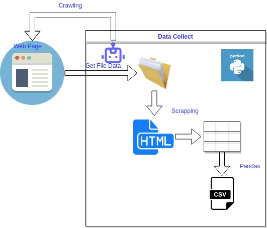

# Estaciones Hidrometeorológicas obtener Nivel de Aporte
Automatizacion de la recolección de datos de Nivel de Aporte desde la pagina web de UTE [https://apps.ute.com.uy/SgePublico/BajadasGE.aspx](https://apps.ute.com.uy/SgePublico/BajadasGE.aspx)


Gráficamente:



Tutorial en Youtube https://youtu.be/pnRjagjO13c :

[](https://www.youtube.com/watch?v=pnRjagjO13c)


## Instalación de dependencias
Instalamos las librerías dependientes desde requirements.txt

```bash
pip3 install -r requirements.txt
```

## Ejecutar
Al ejecutar el comando

```bash
python run.py
```
Se procederá a:
- crear la estructura de directorios
- descargar los archivos con informacion raw en la carpeta  tmp/download/data_nivel_aporte
- exportar los archivos raw a formato csv en la carpeta data/data_nivel_aporte
- crear la estructura de cuenca, subcuenca, estacion y paso en el archivo data/ute_cuencas_subcuencas_estaciones_pasos.json


 